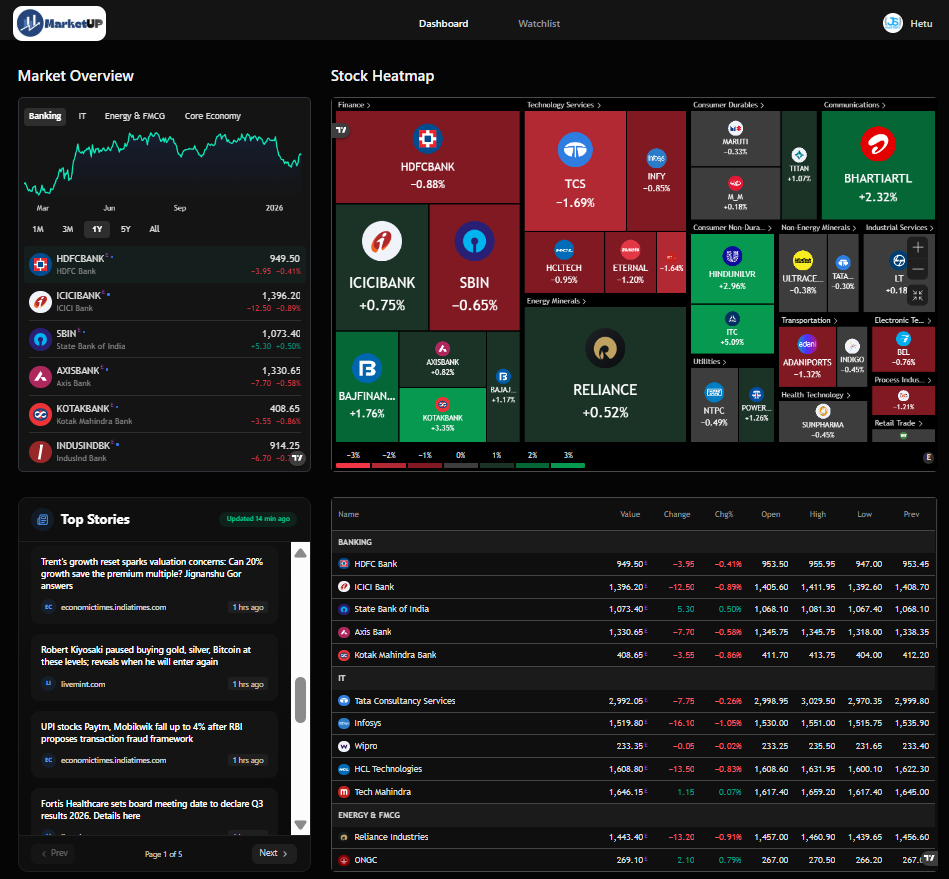

<div align="center">
  <br />
    
  <br />

  <div>
    
    
    
    
    
    
  </div>

  <h3 align="center">MarketUP — AI-Powered Indian Stock Market Insights</h3>

   <div align="center">
    Empowering Indian investors with real-time tracking, AI-curated news, and event-driven automation.
    </div>
</div>

## 📋 Table of Contents

1. 🚀 [Introduction](#-introduction)
2. ⚙️ [Tech Stack](#️-tech-stack)
3. 🔋 [Features](#-features)
4. 🤸 [Quick Start](#-quick-start)
5. 📂 [Project Structure](#-project-structure)
6. 🌐 [Environment Variables](#-environment-variables)
7. 🛠️ [Troubleshooting](#️-troubleshooting)

<a name="introduction"></a>
## ✨ Introduction

**MarketUP** is a high-performance, AI-driven stock market platform tailored for the Indian financial ecosystem. Built with the latest **Next.js 15**, it offers a professional-grade dashboard for tracking BSE and NSE stocks.

What sets MarketUP apart is its **Event-Driven AI Architecture**. Using **Inngest** and **Google Gemini AI**, the platform automatically analyzes market movements and news for every user, delivering a personalized daily digest straight to their inbox. No more scanning through hundreds of irrelevant headlines—MarketUP tells you exactly what happened to the stocks *you* care about.

<a name="tech-stack"></a>
## ⚙️ Tech Stack

- **Framework**: [Next.js 15 (App Router)](https://nextjs.org/)
- **Authentication**: [Better Auth](https://www.better-auth.com/) (Secure, framework-agnostic)
- **Workflow Orchestration**: [Inngest](https://www.inngest.com/) (Reliable background jobs & crons)
- **Database**: [MongoDB](https://www.mongodb.com/) with [Mongoose](https://mongoosejs.com/)
- **Artificial Intelligence**: [Google Gemini AI](https://ai.google.dev/) (Sentiment analysis & summarization)
- **Emailing**: [Nodemailer](https://nodemailer.com/) (Custom transactional templates)
- **Styling**: [Tailwind CSS](https://tailwindcss.com/) & [Shadcn UI](https://ui.shadcn.com/)
- **Data Aggregation**: Real-time RSS feeds from Economic Times, MoneyControl, and LiveMint.

<a name="features"></a>
## 🔋 Features

👉 **Smart Stock Dashboard**: Track BSE/NSE stocks with high-fidelity charts powered by **TradingView**. Switch between line and candlestick views for deep technical analysis.

👉 **Intelligent Search**: A lightning-fast command-menu interface (`Ctrl+K`) to find any Indian stock instantly.

👉 **Personalized Watchlists**: Effortlessly curate your portfolio and keep an eye on potential movers.

👉 **AI Daily Digests**: Every morning at 6:30 AM (IST), MarketUP runs a background workflow that:
   - Identifies news for stocks in your watchlist.
   - Summarizes complex financial data using Gemini AI.
   - Emails you a clean, readable summary.

👉 **Personalized Welcome**: New users receive an AI-generated welcome email tailored to their specific investment goals and risk tolerance.

👉 **Responsive & Accessible**: A beautiful dark-mode interface that works perfectly on everything from wide monitors to mobile phones.

<a name="quick-start"></a>
## 🤸 Quick Start

### 1. Clone & Install
```bash
git clone https://github.com/your-username/market-up.git
cd market-up
npm install
```

### 2. Configure Environment
Create a `.env` file in the root directory (see the [Environment Variables](#-environment-variables) section for keys).

### 3. Run Development
```bash
# Terminal 1: Next.js App
npm run dev

# Terminal 2: Inngest Dev Server (Crucial for AI workflows)
npx inngest-cli@latest dev
```

Visit [http://localhost:3000](http://localhost:3000) to explore the platform.

<a name="project-structure"></a>
## 📂 Project Structure

```text
market-up/
├── app/                  # Next.js 15 App Router
│   ├── (auth)/           # Authentication routes (Sign-in/Sign-up)
│   ├── (root)/           # Main application dashboard and stock pages
│   ├── api/              # API Endpoints (Inngest, Watchlist, Unsubscribe)
│   └── watchlist/        # Dedicated watchlist management page
├── components/           # UI Component Library
│   ├── forms/            # Reusable form fields
│   ├── ui/               # Shadcn primitive components
│   └── watchlist/        # Watchlist-specific UI elements
├── database/             # MongoDB Schema & Connection
├── lib/                  # Application Core Logic
│   ├── actions/          # Server Actions (Indian Market, User, Watchlist)
│   ├── inngest/          # AI Workflows & Prompts
│   ├── nodemailer/       # Email Delivery Service
│   └── better-auth/      # Auth Configuration
└── public/               # Static Assets & Icons
```

<a name="environment-variables"></a>
## 🌐 Environment Variables

| Variable | Description |
| :--- | :--- |
| `NEXT_PUBLIC_BASE_URL` | Your app URL (e.g., `http://localhost:3000`) |
| `MONGODB_URI` | MongoDB Atlas connection string |
| `BETTER_AUTH_SECRET` | Secret for session signing |
| `GEMINI_API_KEY` | Google AI Studio API Key |
| `NODEMAILER_EMAIL` | SMTP Sender Email |
| `NODEMAILER_PASSWORD` | SMTP App Password |

<a name="troubleshooting"></a>
## 🛠️ Troubleshooting

- **Emails not sending?** Ensure you're using an **App Password** for Gmail, not your standard password.
- **AI Summary empty?** Make sure you have added at least one stock to your watchlist. If the watchlist is empty, the system defaults to general market news.
- **Inngest functions not appearing?** Ensure the Inngest Dev Server is running (`npx inngest-cli dev`) and pointing to `http://localhost:3000/api/inngest`.

---
Built with ❤️ for the next generation of Indian Investors.
